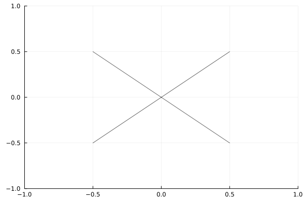

```@setup modelingkits
using Plots
default(legend = false)
using GridMethod

function plot_lines!(P, N, r)
    HH = [GridMethod.tree_nthleaves(2, i) for i in 0:N]
    r₀ = r
    @gif for H in HH
        for p in H
            for q in GridMethod.tree_nextleaves(p, r₀)
                pp = [p, q, [NaN, NaN]]
                plot!(P, first.(pp), last.(pp), line = (:black, 1, 0.6))
            end
        end
        r₀ *= r
    end every 1
end
```

# Modeling kits

We do not implement a modeling language.
Instead, we offer easily to build compatibility with your favorite system.
Available packages are [HomotopyContinuation.ModelKit.jl](https://www.juliahomotopycontinuation.org/HomotopyContinuation.jl/stable/model_kit/#ModelKit/) and [ModelingToolkit.jl](https://github.com/SciML/ModelingToolkit.jl).
See their configuration files [HC.ModelKit.jl](https://github.com/LauraBMo/GridMethod.jl/blob/main/src/HC.ModelKit.jl) and [ModelingToolkit.jl](https://github.com/LauraBMo/GridMethod.jl/blob/main/src/ModelingToolkit.jl).

```@example modelingkits
P = plot(1,
         legend = false,
         color = :black,
         xlim = (-1, 1),
         ylim = (-1, 1),
         );
plot_lines!(P, 4, .5)
P
```

<!--  -->

## Now adding from file



```@autodocs
Modules = [GridMethod]
Pages   = ["HC.ModelKit.jl", "ModelingToolkit.jl"]
```

