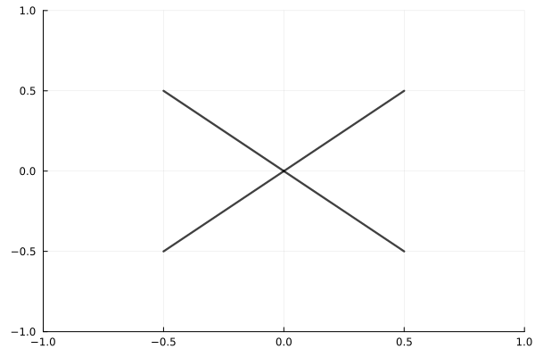

```@setup treefractal
using Plots; gr()
Plots.reset_defaults()
```

# Cross-Tree fractal in cube

  The nodes of the grid form the leaves of a cross-form tree fractal.
  The `tree` function generates the Nth level leaves of a tree fractal with dim dimensions. 
  It generates new points for the fractal iteratively.
  
#### Tree fractal

  

  *See [Image code](@ref)*

## Documentation

```@autodocs
Modules = [GridMethod]
Pages   = ["Tree.jl"]
Private = false
```

## Image code

Code used to generate image [Tree fractal](@ref).

```@example treefractal
using Plots
using GridMethod

function plot_lines!(P, N, r, w, dw, c, dc)
    r₀, w₀, c₀ = r, w, c
    tree = Tree()
    dirs = pmones()
    @gif for _ in 0:(N-1)
        new_tree = tree_nexttree(tree, r₀, dirs)
        for (i, p) in tree
            for q in tree_findnextleaves(i, new_tree)
                pp = [p, q, [NaN, NaN]]
                plot!(P, first.(pp), last.(pp), line = (:black, w₀, c₀))
            end
        end
        r₀ *= r
        w₀ += dw
        c₀ += dc
        tree = new_tree
    end every 1
end

P = plot(1,
         legend = false,
         color = :black,
         xlim = (-1, 1),
         ylim = (-1, 1),
         );
plot_lines!(P, 7, .5, 2.3, -.4, .75, -.11)
```
